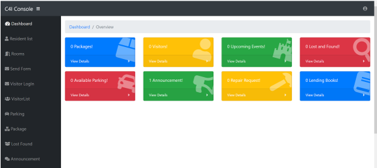
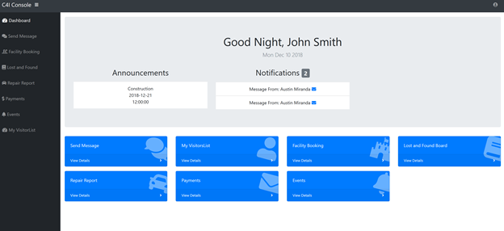
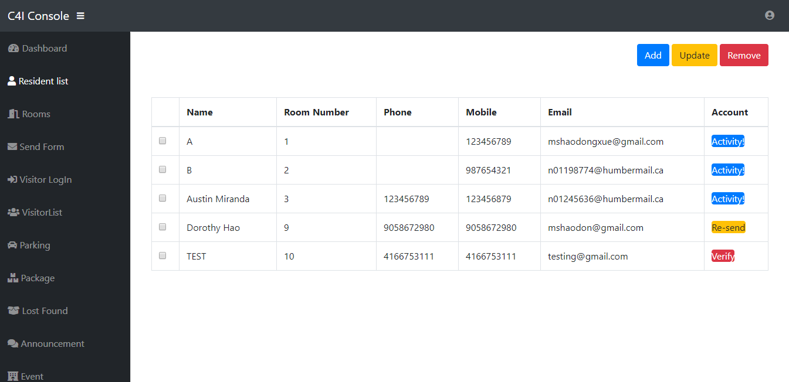
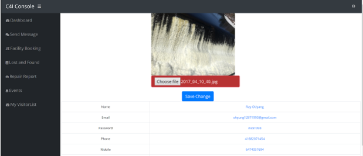
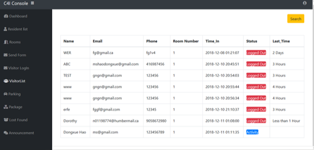
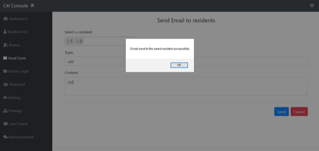
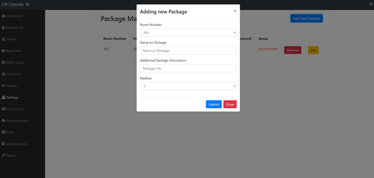
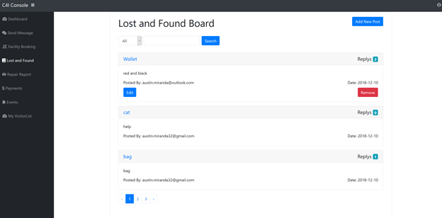
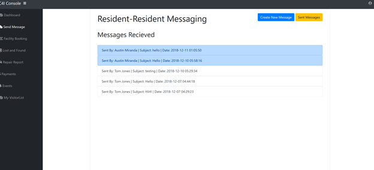

# Condo-Management-System
A web project that using php Laravel framework to development an apartment management system. 
It has two side: resident side and manager side. 
Admin can use this system to verify and check all residents and visitors information, send email to all residents...
Residents can LogIn to their account to check available parking space, pay their bills online, send request to admin...

## How to run the project in your local: 
1. Clone the project to your "C:\xampp\htdocs\";
2. Run the XAMPP(install it if you don't have it): Click on the "Start" button next to "Apache" to start your Apache Web server. Also start "MySQL" as it use mySQL database.
3. Set up database: go to your git bash command and locate the project folder,run the following command:

    `composer install`

    `php artisan migrate` 

    `php artisan db:seed`
4. Open your browser and enter the url "localhost/Condo-Management-System/public/" to logIn;
5. LogIn as a admin role by using username "admin" and password "admin"; LogIn as a resident role by using my account: username: mshaodongxue@gmail.com, password: 1lloU62Y 
6. If you want to register your own account, you need logIn as a admin -> go to resident list menu -> add a resident -> verify this resident, you will get an email from our system with your username and password, then you can logIn using this account as a resident.(Only verified residents can logIn);

## Functionalities
1. Combine user-login and admin-login together, direct to different console page depending on login account;

    adminDashboard:
    

    residentDashboard:
    

2. Must login as admin can Add/Remove/Modify the residents or rooms. Once a resident is created, admin can send a verify email by clicking “verify” button. After resident click the link on email, a user account & password will be created, then resident is able to login as user.
    

3. Resident can edit their profile: change account password, upload photo...
    

4. Visitors Management Flow:
    - Admin side:  visitor logIn with their information and roomNumber they want to visit, and waiting for the resident confirm. At the same time, notification was sent to the resident who he want to visit(by room id);
    - Resident received the notification that this visitor wants to visit you, yes or no?
    - When the resident allowed(which means he clicked yes), visitor’s information are saved in the database, he can go to his visitorList to check this visitor’s information. At the same time in the admin side, can check the visitors information and with the status “active”;
    - When visitor left, he can click the logout button, then this visitor was removed from this resident’s visitor;at the same time, the admin side can see the status of visitor, and if he loggedOut, then can check the “last_time” of this visit;
         

    - Also admin can search visitors by name/email/phone when click “search” button.

5. Send Email to resident: 
    - Admin can send email to multiple residents at the same time form admin email account.
    

6. Announcement: *login as admin*
    - Admin will be able to add/delete/update announcement description, time and date;
    The announcements will show on every users’ dashboard when they login;
7. Facilities Booking:*must login as user*
    - User will be able to request a facility booking if there is no booking at the same time slot. Time out will be calculated automatically based on maximum duration for the facility.  
    They cannot book anytime before current date.
    They can also delete their booking.
    The booking fee will be shown on users’ invoice page.
8. Pay bills:
    - User are able to pay for their remaining fee (booking fee etc);
9. Package Manager:
    - Feature will be used when packages are delivered and the receiving Resident is not home.
    Admin will add Package into the system with the required information. Package will be placed in the 1 of 10 Community mailbox according to information provided. Resident will be sent Email with Mailbox number and password to pick up their package. Resident can confirm received through email link. Following that Admin can Delete the post.
    

10. Lost and Found Board:
    - Lost and Found Message Board for Residents to post a If they have lost of found something, in the condo. Other Residents can reply to the main posts. All posts and replies can be edited or deleted by the user who made them. Users can use a Search to lookup anything of interest. Feature includes Pagination.
    - Admin side has a table of each post, which they can delete if topic is  very outdated, unrelated, etc.
    

11. Resident-Resident Message:
    - Resident Feature, in which Resident can send a message to another Resident in the system. Residents can view all the messages sent and received. The receiving resident will get a notification in the User Dashboard, indication that s/he has received a message and from whom. Feature includes Pagination.
    

12. Repair requests management:
    - Admin will be able to check all repair requests which were submitted by residents from user page. And modify them when they took the requests or finished them

